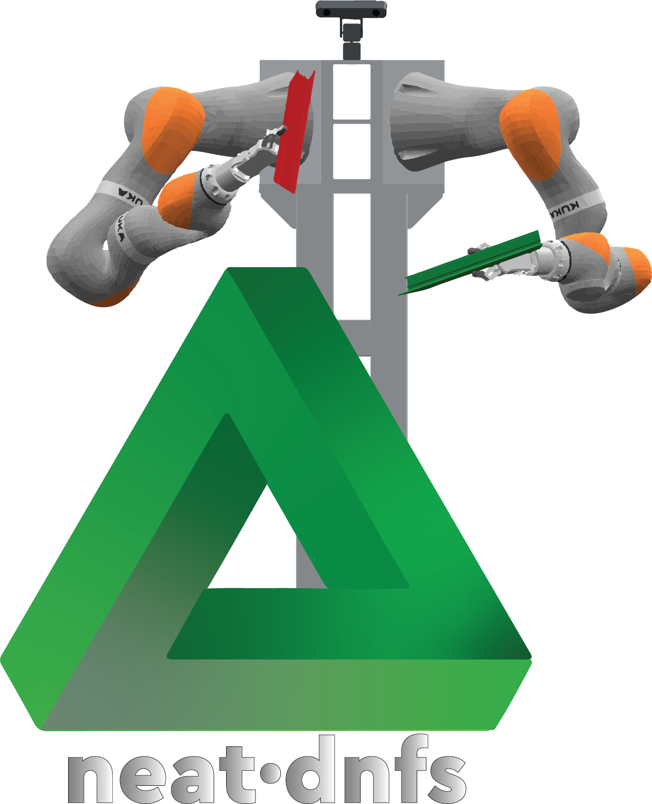
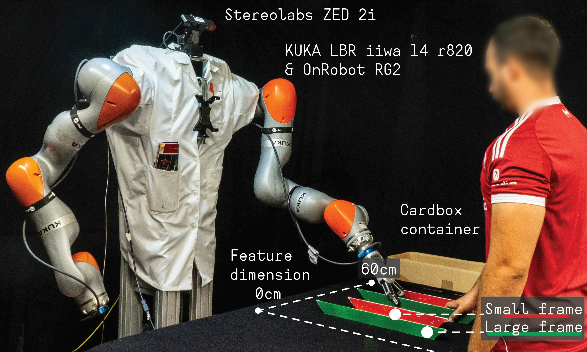

# NeuroEvolution of Dynamic Neural Field Controllers for Human–Robot Collaboration

[](https://docs.ros.org/en/humble/)
[](https://moveit.ros.org/)
[](LICENSE)



This project demonstrates how **Dynamic Neural Field (DNF)** control architectures can be **automatically evolved** using [**NEAT-DNFs**](https://github.com/Jgocunha/neat-dnfs), producing adaptive and interpretable controllers for **human–robot collaboration**.

---

## Overview

Traditional DNF-based robot controllers are manually designed.
In this project, robot control architectures are **automatically synthesized through evolution**, including:

* Neural field parameters
* Network topology
* Inter-field interactions
* Behavioral coordination strategies

The evolved controllers enable robots to:

* Assist humans when cooperation is required
* Act independently when possible
* Withhold action when interference would occur

This results in **adaptive joint action behavior** emerging from neural dynamics rather than predefined logic.

---

## Human–Robot Collaborative Packaging Task

The system was evaluated in a collaborative packaging task where a human and robot manipulate objects together.

| Situation                         | Robot Behaviour                        |
| --------------------------------- | -------------------------------------- |
| Human approaches **large object** | Robot **assists**                      |
| Human approaches **small object** | Robot selects **another small object** |
| Only one small object available   | Robot **does nothing**                 |

The controller operates on a **continuous spatial representation** using Dynamic Neural Fields.



---

## System Architecture

The system is composed of three main components:

1. **Vision Node**

   * Detects objects and human hand position
2. **High-Level Controller**

   * Evolved Dynamic Neural Field controller
3. **Low-Level Controller**

   * Motion planning and robot control (MoveIt 2)

```
Vision → DNF Controller → Motion Planning → Robot
```

The controller itself is evolved using [**NEAT-DNFs**](https://github.com/Jgocunha/neat-dnfs), which evolves: 

* Neural field parameters
* Field interactions
* Network topology
* Hidden processing fields

---

## Repository Structure

```
├── launch/
├── msg/
├── src/
│   ├── high_level_control_node.cpp
│   ├── low_level_control_node.cpp
│   ├── vision_processing_node.py
│   └── controlled_scenarios/
├── data/                # Evolved DNF controllers
├── resources/           # Figures and diagrams
├── CMakeLists.txt
├── package.xml
└── README.md
```

---

## Dependencies

| Dependency | Purpose | Link |
|-------------|----------|------|
| **ROS 2 Humble Hawksbill** | Core middleware | [docs.ros.org/en/humble](https://docs.ros.org/en/humble/) |
| **MoveIt 2** | Motion planning | [moveit.ros.org](https://moveit.ros.org/) |
| **KUKA LBR-Stack** | FRI integration for iiwa | [JOSS Paper](https://joss.theoj.org/papers/10.21105/joss.06138) |
| **OnRobot ROS 2 Driver** | RG2 gripper control | [tonydle/OnRobot_ROS2_Driver](https://github.com/tonydle/OnRobot_ROS2_Driver) |
| **dynamic-neural-field-composer** | DNF simulation library | [Jgocunha/dynamic-neural-field-composer](https://github.com/Jgocunha/dynamic-neural-field-composer) |
| **vcpkg** | External dependency manager | [vcpkg.io](https://vcpkg.io) |

**System Requirements:** Ubuntu 22.04, GCC ≥ 10, Python ≥ 3.8, OpenCV, NumPy  
> ⚠️ Before hardware deployment, see the [Wiki](https://github.com/Jgocunha/neuroevolutionary-joint-action/wiki/Detailed-Setup).

---

## Experimental Results

The evolutionary process was evaluated across **100 independent runs**.

| Metric                           | Result                                             |
| -------------------------------- | -------------------------------------------------- |
| **Success rate**                 | **97% (97/100 runs)**                              |
| **Avg. generations to converge** | **62.58**                                          |
| **Median generations**           | **53**                                             |
| **Std. deviation**               | **35.61**                                          |
| **Typical architecture size**    | ~1–2 hidden fields                                 |
| **Transfer to hardware**         | No parameter retuning required                     |

### Observations

* Evolution consistently discovered **minimal architectures**.
* Most successful controllers contained **one hidden field**.
* Structural innovation followed by parameter tuning was key to success.
* Controllers evolved in simulation **transferred directly to the physical robot**.
* Behaviour generalized to **unseen object configurations and spatial arrangements**.

The evolved controllers autonomously produced:

* Cooperative behaviour
* Complementary action selection
* Action inhibition

All behaviours emerged from **dynamic neural field interactions**, not from predefined logic or symbolic planning.

---

## Video content

[](https://youtu.be/Mvc-DXXC8kQ)

---

## Documentation

For a full exploration of the repository, refer to the [Wiki.](https://github.com/Jgocunha/neuroevolutionary-joint-action/wiki)

---

## Main inspiration for this work

* Amari, Shun-ichi (1977) - "Dynamics of pattern formation in lateral-inhibition type neural fields"
* Schöner, Gregor and Spencer, John and Research Group, Dft (2015) - "Dynamic Thinking: A Primer on Dynamic Field Theory"
* Nolfi, Stefano and Floreano, Dario (2000) - "Evolutionary robotics: the biology, intelligence, and technology of self-organizing machines"
* Floreano, Dario (2023) - "Bio-Inspired Artificial Intelligence: Theories, Methods, and Technologies"
* Erlhagen, Wolfram and Bicho, Estela (2006) - "The dynamic neural field approach to cognitive robotics"
* Krichmar, Jeffrey L. (2018) - "Neurorobotics — A Thriving Community and a Promising Pathway Toward Intelligent Cognitive Robots"
* Stanley, Kenneth O. and Miikkulainen, Risto (2002) - "Evolving Neural Networks through Augmenting Topologies"
* Erlhagen, Wolfram and Bicho, Estela (2014) - "A Dynamic Neural Field Approach to Natural and Efficient Human-Robot Collaboration"
* Pfeifer, Rolf and Bongard, Josh (2006) - "How the Body Shapes the Way We Think: A New View of Intelligence"
* Coombes, Stephen and Beim Graben, Peter and Potthast, Roland and Wright, James (2014) - "Neural fields: theory and applications"
