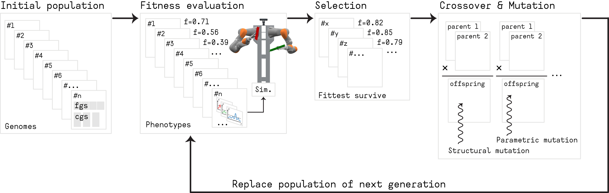

# packaging_task_neat_dnfs

[](https://docs.ros.org/en/humble/) 
[](https://moveit.ros.org/)
[](LICENSE)


This repository implements the experimental setup described in the paper:

> **“NeuroEvolution of Dynamic Neural Field-based Control Architectures for Collaborative Robotic Assistants”**  
> Submitted to *IEEE International Conference on Robotics and Automation (ICRA 2026)*.

The project demonstrates how **Dynamic Neural Field (DNF)** controllers can be **automatically evolved** using the **NEAT algorithm**, achieving adaptive and interpretable human–robot collaboration in a **packaging task**.

---

## Concept Overview

The **neat-dnfs** framework evolves both:

- **Field parameters** (time constants, kernel profiles, excitation/inhibition dynamics)  
- **Topological structure** (number and connectivity of neural fields)  

to produce interpretable DNF-based controllers that autonomously coordinate perception and action.

> The evolved architectures were tested on a **KUKA LBR iiwa 14 R820** with an **OnRobot RG2** gripper and a **StereoLabs ZED 2i** stereo camera.



## Human–Robot Collaborative Packaging Task

| Component | Description |
|------------|-------------|
| **Goal** | The robot must *collaborate* when the human approaches a **large** object, or act *complementarily* when the human targets a **small** object. |
| **Sensing** | The ZED 2i camera detects object types (small/large) and tracks the human hand along a 1-D workspace (0–60 units). |
| **Controller** | An evolved **Dynamic Neural Field (DNF)** controller selects robot actions in real time. |
| **Execution** | Implemented in **ROS 2 Humble** and **MoveIt 2** for trajectory planning and control. |


---

## Repository overview

```
├── CMakeLists.txt
├── package.xml
├── launch/
│   ├── high_level_control_node.launch.py
│   ├── low_level_control_node.launch.py
│   ├── marlab_hardware.launch.py
│   └── tests/
├── msg/
│   ├── SceneObject.msg
│   └── SceneObjects.msg
├── src/
│   ├── high_level_control_node.cpp
│   ├── low_level_control_node.cpp
│   ├── vision_processing_node.py
│   └── controlled_scenarios/
└── data/ — evolved DNF solutions
```
---

## Dependencies

| Dependency | Purpose | Link |
|-------------|----------|------|
| **ROS 2 Humble Hawksbill** | Core middleware | [docs.ros.org/en/humble](https://docs.ros.org/en/humble/) |
| **MoveIt 2** | Motion planning | [moveit.ros.org](https://moveit.ros.org/) |
| **KUKA LBR-Stack** | FRI integration for iiwa | [JOSS Paper](https://joss.theoj.org/papers/10.21105/joss.06138) |
| **OnRobot ROS 2 Driver** | RG2 gripper control | [tonydle/OnRobot_ROS2_Driver](https://github.com/tonydle/OnRobot_ROS2_Driver) |
| **dynamic-neural-field-composer** | DNF simulation library | [Jgocunha/dynamic-neural-field-composer](https://github.com/Jgocunha/dynamic-neural-field-composer) |
| **vcpkg** | External dependency manager | [vcpkg.io](https://vcpkg.io) |

**System Requirements:** Ubuntu 22.04, GCC ≥ 10, Python ≥ 3.8, OpenCV, NumPy  
> ⚠️ Before hardware deployment, see [HARDWARE.md](./HARDWARE.md).

---

---

## Hardware Setup & Launch Instructions 

### 1. Connect to the Robot
- Connect to **KONI port** and **Marlab Wi-Fi**
- On the **SmartPad**, start **LBRServer** with:  
  - FRI send period: `10 ms`  
  - Control mode: `POSITION_CONTROL`  
  - Client IP: your PC (e.g., `192.168.11.2`)

### 2. Start Robot and Drivers
```bash
ros2 launch kuka_lbr_iiwa14_marlab marlab_hardware.launch.py moveit:=true mode:=hardware model:=iiwa14 rviz:=true

ros2 launch onrobot_driver onrobot_control.launch.py onrobot_type:=rg2 connection_type:=tcp ip_address:=172.31.1.4
```
### 3. Control Nodes
| Purpose                 | Command                                                                                             |
| ----------------------- | --------------------------------------------------------------------------------------------------- |
| Log robot state         | `ros2 launch kuka_lbr_iiwa14_marlab state_logger.launch.py mode:=hardware model:=iiwa14`            |
| Joint control           | `ros2 launch kuka_lbr_iiwa14_marlab joint_control.launch.py mode:=hardware model:=iiwa14`           |
| Cartesian path planning | `ros2 launch kuka_lbr_iiwa14_marlab cartesian_path_planning.launch.py mode:=hardware model:=iiwa14` |
| Object pose estimation  | `ros2 launch kuka_lbr_iiwa14_marlab find_object_poses.launch.py mode:=hardware model:=iiwa14`       |
| Low-level control       | `ros2 launch kuka_lbr_iiwa14_marlab low_level_control_node.launch.py mode:=hardware model:=iiwa14`  |
| High-level DNF control  | `ros2 launch kuka_lbr_iiwa14_marlab high_level_control_node.launch.py`                              |

Example topic publication:
```bash
ros2 topic pub /scene_objects kuka_lbr_iiwa14_marlab/msg/SceneObjects "{
  objects: [
    {type: 's', position: 10.0},
    {type: 's', position: 50.0},
    {type: 'l', position: 30.0}
  ]
}"
```
### 4. Vision Node

```bash
ros2 run kuka_lbr_iiwa14_marlab vision_processing_node.py

```

## Experimental Results

| Metric                           | Result                                               |
| -------------------------------- | ---------------------------------------------------- |
| **Success rate (100 runs)**      | 78%                                                  |
| **Avg. generations to converge** | 88.1 ± 45.4                                          |
| **Avg. architecture size**       | 1.9 hidden fields, 10.1 connections                  |
| **Transferability**              | 0 re-tuning required for hardware deployment         |
| **Generalisation**               | Stable behaviour across unseen object configurations |

> The evolved controller autonomously produced both collaborative and complementary behaviours in real-world deployment.

---

## Citation

If you use this repository, please cite the accompanying paper:
```bibtex
@inproceedings{neat_dnfs_icra2026,
  title={NeuroEvolution of Dynamic Neural Field-based Control Architectures for Collaborative Robotic Assistants},
  author={Author One and Author Two and Author Three and Author Four},
  booktitle={IEEE International Conference on Robotics and Automation (ICRA)},
  year={2026}
}
```

## Main References

- Erlhagen & Bicho (2006). The dynamic neural field approach to cognitive robotics.
- Stanley & Miikkulainen (2002). Evolving Neural Networks through Augmenting Topologies (NEAT).
- Floreano & Nolfi (2000). Evolutionary Robotics.
- Bicho et al. (2011). Decision making in joint action: a dynamic neural field model.